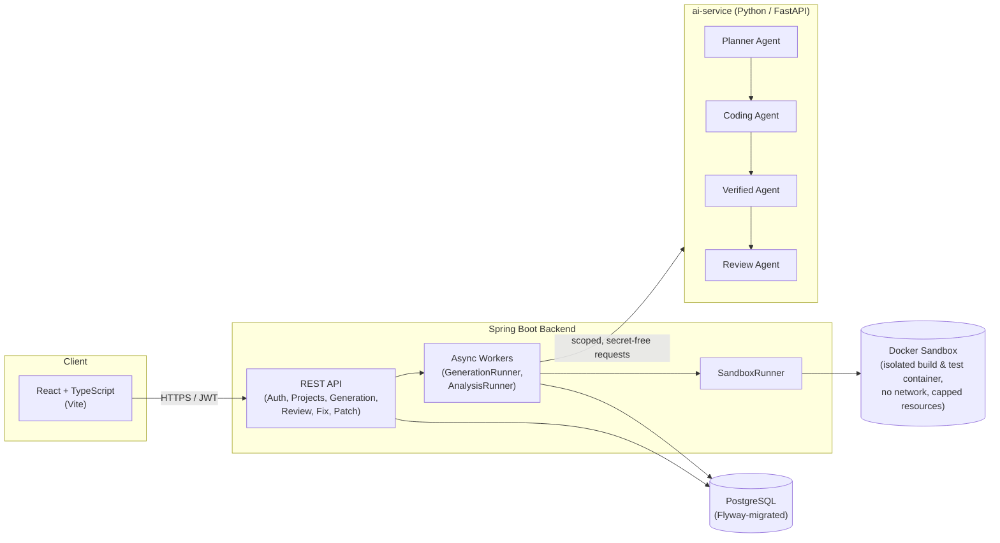

# VeriReview

**Generate. Review. Fix. Verify.**

VeriReview is a full-stack platform that turns a plain-English product idea into a working, reviewed, and verified codebase — or takes a codebase you already have and puts it through the same rigor. It is built around a simple principle: **an AI should never get to say "this code is correct" on its own word.** Every claim VeriReview makes — that a project builds, that its tests pass, that a bug was actually fixed — is backed by something that actually ran, not by a model's confidence.


---

## The Problem

AI code-generation tools are everywhere, but they share the same weakness: they hand you code and *tell you* it works. There is usually no build, no test run, no static analysis, and no independent check — just a confident-sounding explanation. When the code is wrong, you find out later, in production, or after a code review catches what the AI missed.

At the same time, teams reviewing an *existing* codebase face the opposite problem: static analyzers (Checkstyle, PMD, SpotBugs) are thorough but noisy and can't reason about intent, while AI review tools are fluent but can hallucinate issues that don't exist — or miss ones that do — with no way to separate a real finding from a plausible-sounding guess.

## The Solution

VeriReview treats "the AI said so" as insufficient evidence for anything. Instead, it runs a four-agent pipeline where each agent has one job and one job only, and nothing moves forward without proof:

| Agent | Responsibility |
|---|---|
| **Planner** | Reads the requirement and the chosen stack, and produces a concrete file-by-file build plan. |
| **Coding** | Generates the actual project files from that plan — and, later, generates fix diffs for specific findings. |
| **Verified** | Builds and tests the project inside an isolated Docker sandbox and evaluates the real, captured evidence. Nothing is marked verified from a model's say-so. |
| **Review** | Scans the built, verified code — combining deterministic static-analysis tools with an AI review pass — and produces a de-duplicated, ranked list of findings. |

A project only reaches **REVIEWED** after it has been planned, generated, actually compiled, actually tested, and actually scanned. A finding is only marked **fixed** after a patch is proposed, applied, and the project is rebuilt and re-reviewed from scratch — if the same issue still shows up in the new scan, it stays open. Nothing is taken on faith.


---

## Key Features

- **Idea → verified project.** Describe what you want to build and the stack to use; VeriReview plans it, generates it, builds it in a sandbox, tests it, and reviews it — end to end, with live status at every stage.
- **Upload an existing codebase.** Import a ZIP snapshot and run the same deterministic + AI review pipeline against code you already have.
- **Real build verification, not a guess.** Every build and test run happens inside a network-isolated, resource-capped Docker container against a disposable snapshot — never the canonical project, never on the host.
- **Deterministic + AI review, merged and deduplicated.** Checkstyle, PMD, and SpotBugs findings are echoed verbatim and ranked ahead of AI-proposed findings; AI restatements of the same location are dropped rather than double-counted.
- **A real fix loop, not a one-shot patch.** Propose a fix → validate the diff (path-jailed, size-capped, structurally checked) → apply it with an automatic backup and rollback on failure → rebuild → re-verify → re-review. A finding is marked resolved only when it provably stops reproducing.
- **Full audit trail.** Every agent invocation, every build, every patch, and every status transition is recorded with timing and outcome, so the entire history of a project is inspectable after the fact.
- **JWT-based auth**, rate-limited login, and per-owner data isolation throughout.

---

## Architecture



The backend never lets the AI service touch the database, execute untrusted code, or claim a verification result — it only ever proposes plans, files, diffs, and findings. All policy decisions (what counts as verified, what unlocks a download, what closes a finding) live in the backend, where they can be audited and enforced consistently.

---

## Screenshots

<table>
<tr>
<td width="50%">

**Generate a project from a description**

The stack is auto-detected from the description; the same form drives both fresh generation and fix-loop reruns.

</td>
<td width="50%">


</td>
</tr>
<tr>
<td width="50%">

**Login**

JWT-based session auth with rate-limited login attempts.

</td>
<td width="50%">


</td>
</tr>
<tr>
<td width="50%">

**Live deployment**

Deployed with a Spring Boot backend on Render and a Vite/React frontend on Vercel, tracked through Render's deployment history.

</td>
<td width="50%">


</td>
</tr>
</table>

---

## Tech Stack

| Layer | Technology |
|---|---|
| Frontend | React, TypeScript, Vite |
| Backend | Java 21, Spring Boot, Spring Security (JWT), Spring Data JPA |
| Database | PostgreSQL, Flyway migrations |
| AI Service | Python, FastAPI, LangGraph, OpenRouter-compatible LLM client |
| Sandboxing | Docker (isolated, network-disabled, resource-capped containers) |
| Static Analysis | Checkstyle, PMD, SpotBugs, OWASP Dependency-Check |
| Testing | JUnit 5, Mockito, AssertJ, Testcontainers, pytest |
| Deployment | Render (backend), Vercel (frontend) |

---

## Getting Started

### Prerequisites

- Java 21+
- Node.js 18+
- Python 3.11+
- Docker Desktop (required for real build verification and static analysis; see [Docker sandbox note](#docker-sandbox-note) below for environments without it)
- PostgreSQL 16+ (or use the provided `docker-compose` service)

### Backend

```bash
cd backend
# Copy the repo-root .env.example to .env and fill in JWT_SIGNING_KEY,
# datasource credentials, and AI_SERVICE_INTERNAL_SECRET
./mvnw spring-boot:run
```

The backend starts on `http://localhost:8080` and runs its Flyway migrations automatically on boot.

### ai-service

```bash
cd ai-service
python -m venv .venv
.venv\Scripts\activate.bat   # or `source .venv/bin/activate` on macOS/Linux
pip install -e .
uvicorn app.main:app --reload --port 8001
```

### Frontend

```bash
cd frontend
npm install
npm run dev
```

The app is available at `http://localhost:5173`.

---

## Docker Sandbox Note

Real build/test execution and deterministic static analysis both require Docker. On deployment hosts without Docker-in-Docker support, set:

```
DOCKER_SANDBOX_ENABLED=false
```

With this flag, the backend skips container execution cleanly instead of crashing: generation builds are explicitly marked *skipped* (never silently reported as passed), and uploaded-project reviews fall back to AI-only findings while deterministic tools report `SKIPPED_DISABLED`. Leave it unset (or `true`) anywhere Docker is actually available — this is the mode that gives VeriReview's core guarantee: nothing is verified without real evidence.

---

## Known Limitations

- Without Docker, build/test verification is skipped rather than performed — a known, explicit trade-off for hosting on platforms without container-in-container support.
- The fix loop currently supports one finding per patch cycle; batched multi-finding patches are on the roadmap.
- Free-tier hosting (Render's free web service) cold-starts after inactivity, adding latency to the first request after idle.

## Roadmap

- [ ] Batched multi-finding patch proposals
- [ ] Optional VPS deployment guide with real Docker-in-Docker sandboxing in production
- [ ] Per-project webhook notifications on review completion
- [ ] Configurable static-analysis rule sets

## License

This project is available under the MIT License.